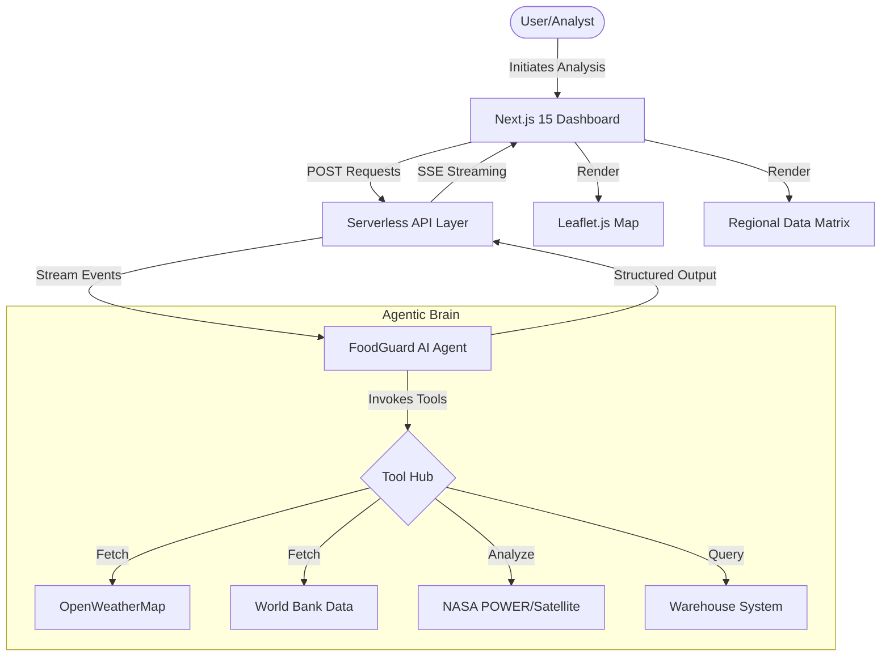
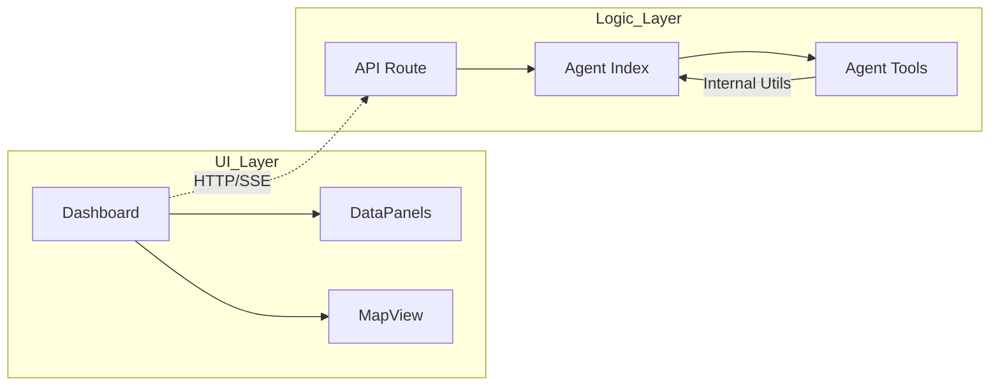
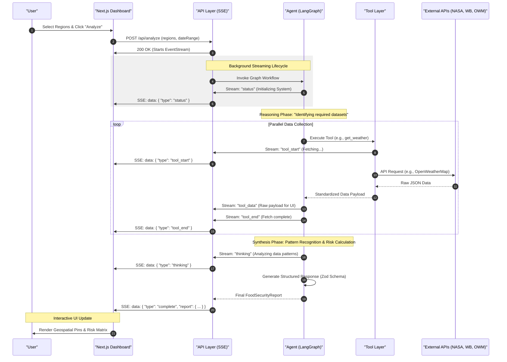
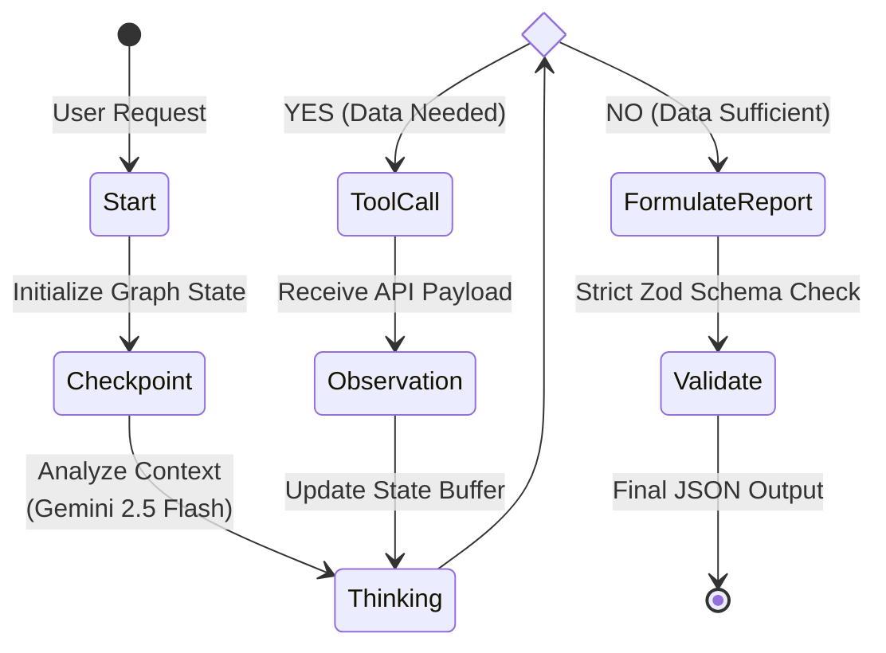

# FoodGuard AI: National Food Supply Prediction System

## 🚀 Project Overview

**FoodGuard AI** is an enterprise-grade, AI-powered predictive dashboard designed to safeguard Pakistan's food security. By leveraging **Agentic Workflows**, real-time API integrations, and advanced satellite data, FoodGuard AI predicts regional food shortages before they occur, enabling proactive logistics and policy interventions.

### 💡 The Problem
Food supply chains in Pakistan are often reactive, responding to shortages only after prices spike or reserves fail. Traditional systems lack the real-time integration of weather patterns, global market trends, and regional inventory.

### ✨ Our Solution
FoodGuard AI introduces an **autonomous AI Analyst** that "senses" the environment through multiple data channels, reasons about risks using the **Gemini 2.5 Flash** model, and provides structured, actionable reports with 90%+ confidence scores.

---

## 🧠 System Architecture Overview

The system is built on a **Modular Agentic Architecture**. It separates the "Brain" (AI Agent) from the "Senses" (API Tools) and the "Body" (Next.js Frontend).

### 📐 Architecture Diagram

---

## 🧩 Component Breakdown

### 1. AI Agent Core (`src/lib/agent/index.ts`)
* **Purpose**: The decision-making engine.
* **Responsibilities**: Orchestrates tool calls, analyzes data correlations, and generates structured JSON reports.
* **Key Tech**: LangChain.js, LangGraph, Gemini 2.5 Flash.

### 2. Data Collection Layer (`src/lib/agent/tools.ts`)
* **Purpose**: Fetches ground-truth data.
* **Responsibilities**: Real-time integration with OpenWeatherMap (local weather), World Bank (global prices), and NASA (crop health).
* **Key Tech**: Zod-validated tools, Fetch API.

### 3. Serverless API (`src/app/api/analyze/route.ts`)
* **Purpose**: Bridges the frontend and agent.
* **Responsibilities**: Manages the life-cycle of the analysis, providing real-time streaming updates via Server-Sent Events (SSE).
* **Key Tech**: Next.js App Router, ReadableStream.

### 4. Neobrutalist Dashboard (`src/components/Dashboard.tsx`)
* **Purpose**: Provides high-visibility data visualization.
* **Responsibilities**: Displays live analysis progress, regional risk maps, and an interactive AI chat assistant for deep-dives.
* **Key Tech**: Tailwind CSS, ShadCN UI, Lucide Icons, Leaflet.js.

---

## 🔗 Module Dependency Graph

---

## 🔄 Application Execution Flow

1.  **Selection**: User selects regions (e.g., Lahore, Multan) on the Dashboard.
2.  **Streaming Initialization**: The API initializes a stream and invokes the `structuredAgent`.
3.  **Parallel Sensing**: The agent concurrently fetches weather, market, and crop health data for each region.
4.  **Reasoning**: Gemini analyzes the delta between historical trends and current data.
5.  **Streaming Updates**: As tools complete, the UI updates "live" with status logs and tool data.
6.  **Finalization**: The agent generates a structured `FoodSecurityReport` (JSON), which triggers the final UI state (Map markers + Risk Matrix).

---

## ⏱️ Sequence Diagram (Agent Workflow)

This diagram illustrates how the Agent handles a single analysis request.

---

## 🧠 Agent Intelligence Cycle (LangGraph)

This diagram shows the internal state machine of the FoodGuard Agent. It follows a recursive **Reason-Act-Observe** pattern to ensure data completeness before generating the final report.

---

## 🛠️ Technology Stack

*   **Framework**: Next.js 15 (App Router, Serverless)
*   **AI Orchestration**: LangChain.js & LangGraph.js
*   **Large Language Model**: Google Gemini 2.5 Flash
*   **Styling**: Tailwind CSS (Neobrutalist Theme)
*   **Data Sources**: OpenWeatherMap, World Bank API, NASA POWER
*   **Geospatial**: Leaflet.js & React-Leaflet
*   **Validation**: Zod (Strict Schema Definition)

---

## 📊 Design Decisions

*   **Neobrutalist UI**: Chosen for its high contrast and "Information-First" aesthetic, suitable for high-stakes government and NGO monitoring.
*   **Agentic Framework**: Traditional APIs follow fixed logic; our Agentic workflow allows the AI to decide *which* tools are most relevant based on the user's specific request.
*   **SSE Streaming**: Essential for UX—since AI analysis can take 10-20 seconds, streaming provides immediate feedback and increases perceived performance.

---

## 🚧 Limitations

*   **Simulated Data**: Regional warehouse stocks and historical shortage records are currently simulated; real-world integration requires direct access to PASSCO/Gov databases.
*   **Connectivity**: System depends on the availability of 3rd party APIs (NASA/World Bank).

---

## 🔮 Future Improvements

*   **Satellite Image Processing**: Integrating Gemini Vision to analyze actual crop snapshots for pest detection.
*   **Mobile Pulse**: SMS integration to alert farmers in offline regions about predicted shortages.
*   **Predictive Logistics**: Automatically suggesting the most cost-effective truck routes between surplus and shortage regions.
